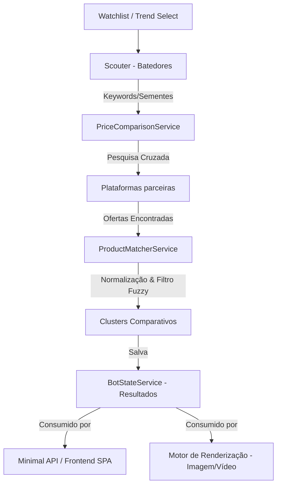

# Arquitetura do Sistema

Este documento detalha as decisões de design arquitetural, a divisão de módulos, o fluxo de controle e as interações entre os componentes da plataforma **RZND Media**.

## Visão Geral da Arquitetura

O sistema é desenhado sob uma arquitetura de **processo único local**, operando simultaneamente como um serviço em segundo plano (Background Service) para busca de ofertas e um servidor web local (Minimal API + Arquivos Estáticos) para controle e exibição em tempo real.

O fluxo global de arquitetura funciona da seguinte forma:
1. **Captação (Bot Scouters)**: Varreduras periódicas ou manuais buscam ofertas e sementes nas lojas (Shopee, Amazon, Magalu).
2. **Normalização e Match (Fuzzy & Colisão)**: Limpeza dos títulos e comparação de ofertas similares para formar clusters comparativos.
3. **Persistência de Resultados**: Atualização do estado global compartilhado e geração de dados prontos para a geração de criativos.
4. **Geração de Mídia (Próxima Etapa)**: Consumo dos clusters de ofertas mais baratas pelo motor de renderização para gerar artes/vídeos promocionais de alta conversão.

## Padrões Arquiteturais

- **Scatter-Gather**: Distribuição da busca das keywords em múltiplos canais em paralelo e agregação dos dados de ofertas retornados.
- **Background Worker**: Execução contínua em segundo plano gerenciada pelo host do .NET.
- **Shared State (Singleton)**: Sincronização entre o ciclo de busca e a API HTTP através de serviço em memória thread-safe.

## Divisão de Camadas (Layers)

- **Presentation Layer (Frontend SPA)**: Arquivos estáticos em HTML/CSS/JS servidos pelo Kestrel que consomem a Minimal API local.
- **API Layer (Minimal API)**: Controladores enxutos expostos na porta `5100` que mediam a leitura de configurações, acionamento manual de tarefas e status.
- **Business Logic Layer (Services)**:
  - `PriceComparisonService`: Orquestrador do fluxo Scatter-Gather.
  - `ProductMatcherService` & `TitleNormalizer`: Motor fuzzy de comparação de strings e sanitização de ruído.
- **Provider/Data Layer**: Coletores especializados de dados (`ShopeeApiProvider`, `AmazonDetailsFetcher`, `MagaluDetailsFetcher`) rodando em modo real ou modo simulado.

## Fluxo de Processamento de Dados

## Comunicação Inter-módulos

A comunicação entre a API HTTP (Kestrel) e o Worker em background é mediada pelo `BotStateService`. Para evitar esperas ocupadas ou polling interno no worker, um `SemaphoreSlim` é utilizado para acionar um sinal de liberação imediata sempre que o usuário clica em "Executar Agora" na interface, interrompendo o ciclo de delay normal de 15 minutos do worker.

## Decisões Arquiteturais Relevantes (ADR Reference)

Consulte o documento de decisão arquitetural em [Bot de Ofertas Open Source.md](file:///c:/Repos/rznd-media/docs/adr/Bot%20de%20Ofertas%20Open%20Source.md) para mais detalhes sobre a escolha do FuzzySharp, do processo unificado e da injeção de dependência.
